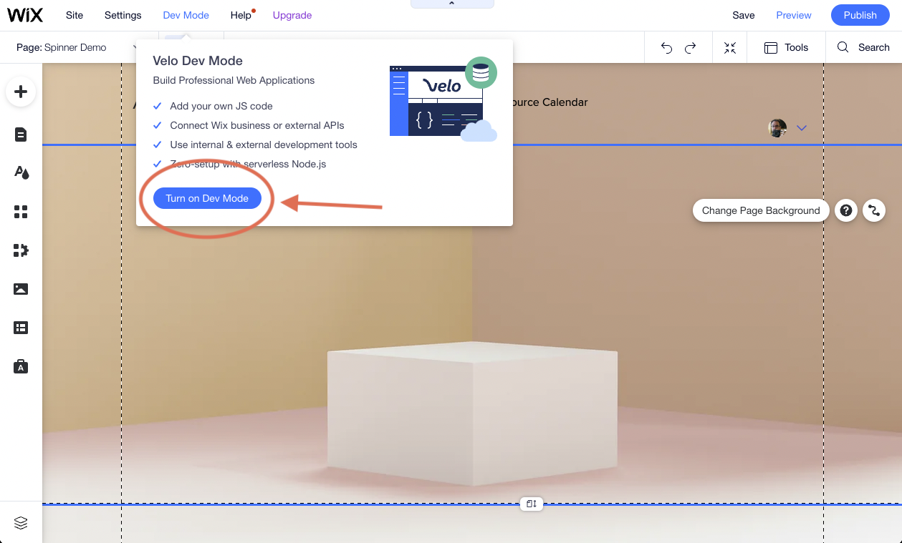
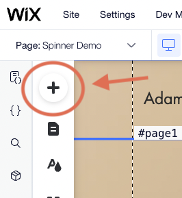
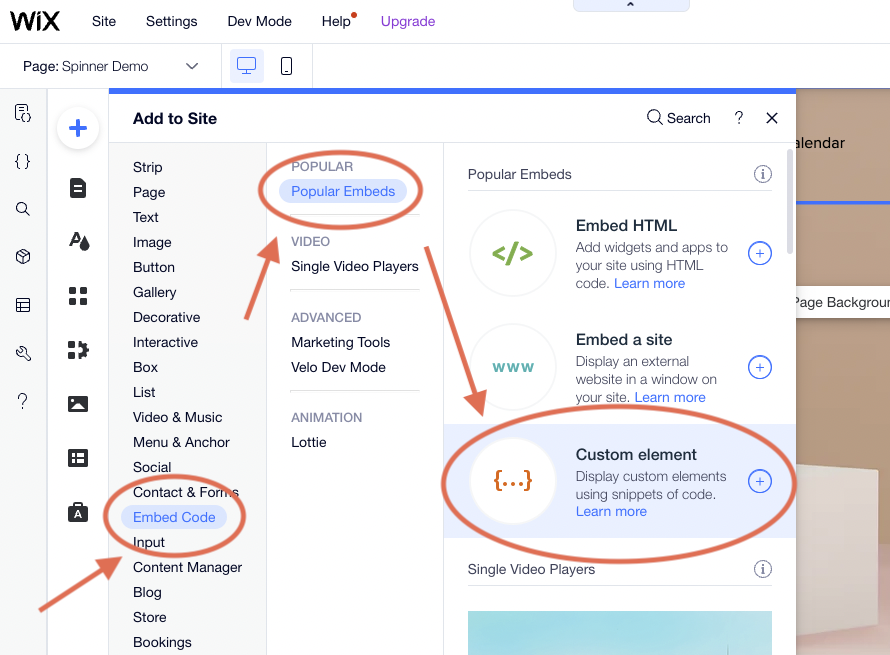
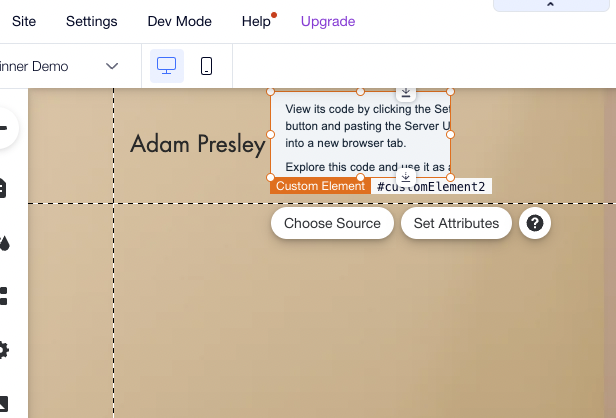
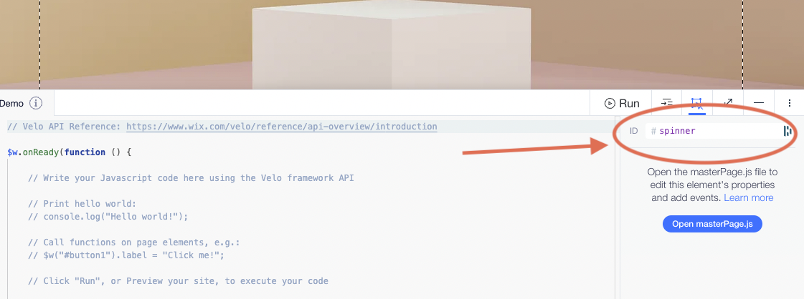
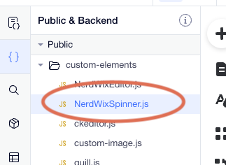
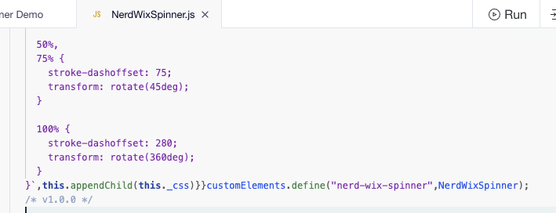
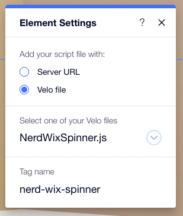
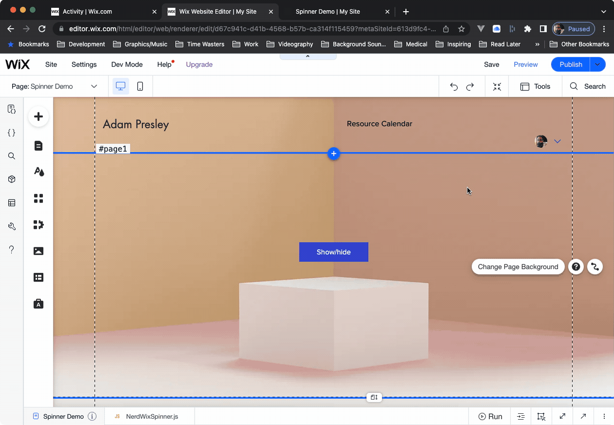

# Nerd Wix Spinner

Nerd Wix Spinner is a web component that will display a shim and a loading spinner graphic. This component is designed to work on Wix websites and within Wix's limitations, though it is not limited to just Wix usage. 

Click [here](https://www.appnerds.net/spinner-demo) to view a demo of Nerd Wix Spinner in action!

## 🚀 Quick Start

To begin ensure your Wix site has **Dev Mode** enabled. If you are unsure how to do this please see [https://support.wix.com/en/article/about-velo-by-wix](https://support.wix.com/en/article/about-velo-by-wix). 



Now follow these steps to configure this component to be used on any page in your site.

### Add a Custom Element

Click the *Plus Button* to add an element to the page.



Choose *Embed Code* -> *Popular Embeds* -> *Custom Element*.



You can resize the element to be smaller if you like. It does not have to be large as the shim and spinner are generated dynamically. Make sure you drag the custom element to the header so it is available on all pages.



Now open the developer code panel found at the bottom of the window. Find the properties panel and change the ID of the custom element to `spinner`.



Open the **Public & Backend** panel, and in the *Public* section add a new JS file named `NerdWixSpinner.js` under the folder named *custom-elements*. If you do not have a folder named *custom-element* create it.



When you add this new file the code panel at the bottom of the window opens. Copy the contents from [./dist/NerdWixSpinner.js](./dist/NerdWixSpinner.js) onto your clipboard and paste them into your new JavaScript file in Wix.



Now that we have the code we need to point the custom element to this code. Go back to the page and click on the custom element, then click on **Choose Source**. Selecting *Velo File* will present a drop down. In this drop down select the file **NerdWixSpinner.js**. Scroll down a little and enter the tag name `nerd-wix-spinner`.



Congratulations! The Nerd Wix Spinner is configured!

## Usage

The Nerd Wix Spinner component has one primary operations: **show**.

To show the spinner, execute the following code. This code assumes you've named the custom element **spinner**.

```js
$w("#spinner").setAttribute("show", true);
```

To hide the spinner:

```js
$w("#spinner").setAttribute("show", false);
```



